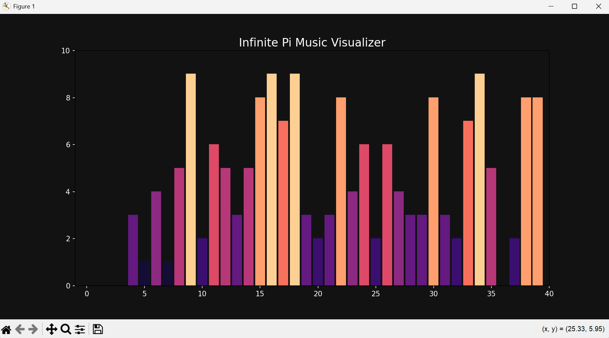
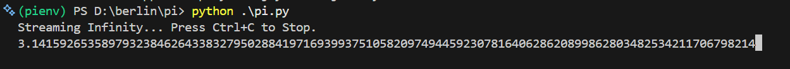

# pi-visualizer-symphony

A real-time generative audio-visualizer that maps the infinite digits of Pi to a pentatonic scale and dynamic bar-chart visualization.





## Core Logic
This project utilizes a **Spigot Algorithm** to calculate $\pi$ digits sequentially. Each digit [0-9] acts as a trigger for:
- **Audio Synthesis**: Real-time waveform generation mapped to a C-Pentatonic scale.

## Prerequisites
- Python 3.8+
- PortAudio (required for `sounddevice`)

## Installation
```bash
pip install numpy sounddevice matplotlib